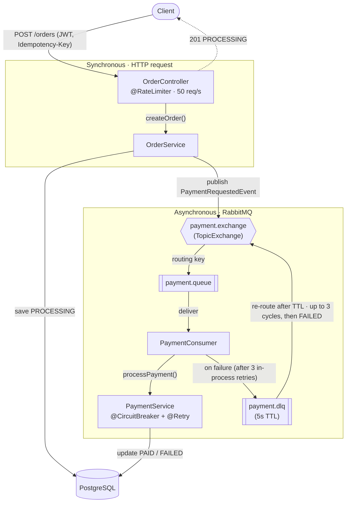

# PayFlow - Async Payment Processing System

[](https://github.com/VivaldoDjol/payflow/actions/workflows/ci.yml)

An idempotent, fault-tolerant payment order service built with **Java 21**, **Spring Boot 3.4.5**, and **RabbitMQ**. Orders are accepted synchronously over HTTP and processed asynchronously through a message-driven pipeline with circuit breaker protection, automatic retries, and dead-letter queue recovery.

---

## Architecture



**Processing Flow:**

1. `OrderController` receives `POST /orders`, rate-limited to 50 req/s. The `Idempotency-Key` header is optional - if omitted, a UUID is generated.
2. `OrderService` checks for a duplicate idempotency key, saves the order as `PROCESSING`, and publishes a `PaymentRequestedEvent` to RabbitMQ.
3. `PaymentConsumer` calls `PaymentService.processPayment()`, which retries 3x in-process (500ms apart) via `@Retry`, with a circuit breaker guarding the call. On success the order becomes `PAID`.
4. If all in-process retries fail, the message is rejected to `payment.dlq` (5s TTL) and re-routed back to the main queue. After 3 such DLQ cycles (tracked via the `x-death` header), the order is permanently marked `FAILED`.

---

## Tech Stack

| Layer         | Technology                                            | Version                            |
|---------------|-------------------------------------------------------|------------------------------------|
| Language      | Java (LTS)                                            | 21                                 |
| Framework     | Spring Boot                                           | 3.4.5                              |
| Security      | OAuth2 Resource Server, Keycloak                      | Spring Security 6.4                |
| Data          | Spring Data JPA, PostgreSQL                           | PostgreSQL 15 (16-alpine in tests) |
| Messaging     | RabbitMQ (Spring AMQP)                                | RabbitMQ 3.13                      |
| Resilience    | Resilience4j (Circuit Breaker, Retry, Rate Limiter)   | 2.4.0                              |
| Tracing       | Micrometer + Brave + Zipkin                           | Boot-managed                       |
| Testing       | JUnit 5, Mockito, Testcontainers, Awaitility, AssertJ | Testcontainers 1.21.4              |
| Documentation | SpringDoc OpenAPI (Swagger UI)                        | 2.8.3                              |
| Observability | Spring Boot Actuator, JSON logging (Logstash encoder) | 7.4                                |
| CI/CD         | GitHub Actions, GitHub Container Registry             | -                                  |
| Build         | Maven, Docker multi-stage                             | -                                  |

---

## Features

### Idempotent Order Creation
Every `POST /orders` accepts an `Idempotency-Key` header (alphanumeric + `_-`, max 64 chars). If the key already exists, the original order is returned without creating a duplicate. If no key is provided, one is auto-generated. Enforced at both the application layer (`findByIdempotencyKey`) and the database layer (unique constraint).

### Async Payment Processing
Orders return immediately with `201 PROCESSING`. Payment logic runs asynchronously via RabbitMQ, decoupling the HTTP response time from payment gateway latency. The consumer updates the order status to `PAID` or `FAILED` once processing completes.

### Dead-Letter Queue Retry Pattern
Failed payments are rejected (not requeued) and routed to `payment.dlq` via a dead-letter exchange. The DLQ has a 5-second TTL, after which messages are re-routed back to the main queue for retry. Retry count is tracked via the RabbitMQ `x-death` header. After 3 DLQ cycles, the order is permanently marked as `FAILED`.

### Resilience4j Fault Tolerance
- **Circuit Breaker** on `PaymentService.processPayment()` - COUNT_BASED sliding window (10 calls), opens at 50% failure rate, auto-transitions to half-open after 30s. Only records `PaymentGatewayException`; ignores permanent errors like `IllegalArgumentException`.
- **Retry** runs *inside* the circuit breaker (aspect order 2 inside order 1) - 3 attempts with 500ms wait, only retries `PaymentGatewayException`. Because the breaker is the outer aspect, it records one outcome per call (after retry finishes), so transient blips absorbed by retry never trip it - only failures that survive all 3 attempts count toward the failure rate.
- **Rate Limiter** on `OrderController.createOrder()` - 50 requests per second with immediate rejection (0s timeout).

### OAuth2/JWT Security
Stateless JWT authentication via Keycloak. Scope-based authorisation:
- `POST /orders` requires `orders:write`
- `GET /orders/{id}` requires `orders:read`
- Public endpoints: `/`, `/actuator/**`, `/swagger-ui/**`, `/v3/api-docs/**`

### Distributed Tracing
Full trace propagation from HTTP request through RabbitMQ to payment processing via Micrometer Tracing + Brave. Trace IDs appear in JSON-structured logs (via Logback MDC) and are exported to Zipkin for visualisation.

### Structured JSON Logging
All application logs are output as JSON via Logstash Logback Encoder, including `timestamp`, `level`, `service`, `thread`, `logger`, `message`, `exception`, and MDC fields (`traceId`, `spanId`).

---

## API Reference

### Authentication

All `/orders` endpoints require a Bearer JWT issued by the Keycloak `payflow` realm. Keycloak's issuer is pinned to `http://localhost:8180` (via `KC_HOSTNAME_URL`), so a token works the same whether you fetch it from the host or from inside the Docker network. With the stack running, grab one for the pre-seeded test user via the password grant:

```bash
TOKEN=$(curl -s -X POST \
  "http://localhost:8180/realms/payflow/protocol/openid-connect/token" \
  -H "Content-Type: application/x-www-form-urlencoded" \
  -d "grant_type=password&client_id=payflow-app&client_secret=payflow-dev-secret&username=testuser&password=testuser123&scope=openid orders:read orders:write" \
  | python3 -c "import sys,json; print(json.load(sys.stdin)['access_token'])")

curl -s http://localhost:8080/orders/1 -H "Authorization: Bearer $TOKEN"
```

Or in **Swagger UI**, click **Authorise** and sign in with client `payflow-app` / `payflow-dev-secret` and user `testuser` / `testuser123`.

| Test credential | Value                                |
|-----------------|--------------------------------------|
| Realm           | `payflow`                            |
| Client          | `payflow-app` / `payflow-dev-secret` |
| User            | `testuser` / `testuser123`           |
| Scopes          | `orders:read`, `orders:write`        |

> The app validates tokens against Keycloak's JWKS (reachable in-network at `keycloak:8080`) while accepting the pinned `localhost:8180` issuer — so the same token is valid from the browser, the host, and the container.

### Create Order

```
POST /orders
```

**Headers:**
| Header | Required | Description |
|---|---|---|
| `Authorization` | Yes | `Bearer <JWT>` with `orders:write` scope |
| `Idempotency-Key` | No | Unique key for idempotent creation (auto-generated if omitted) |
| `Content-Type` | Yes | `application/json` |

**Request Body:**
```json
{
  "amount": 29.99,
  "currency": "GBP"
}
```

**Response `201 Created`:**
```json
{
  "id": 1,
  "amount": 29.99,
  "currency": "GBP",
  "status": "PROCESSING",
  "idempotencyKey": "order-abc123",
  "createdAt": "2026-03-28T10:30:00Z"
}
```

### Get Order

```
GET /orders/{id}
```

**Headers:**
| Header | Required | Description |
|---|---|---|
| `Authorization` | Yes | `Bearer <JWT>` with `orders:read` scope |

**Response `200 OK`:**
```json
{
  "id": 1,
  "amount": 29.99,
  "currency": "GBP",
  "status": "PAID",
  "idempotencyKey": "order-abc123",
  "createdAt": "2026-03-28T10:30:00Z"
}
```

### Error Responses

All errors follow the RFC 9457 Problem Detail format:

| Status | Title                  | When                                                            |
|--------|------------------------|-----------------------------------------------------------------|
| 400    | Invalid Request        | Validation failure, illegal argument, or missing path variable  |
| 400    | Invalid Request Body   | Malformed or unreadable JSON                                    |
| 400    | Type Mismatch          | Path/query parameter of the wrong type (e.g. `/orders/abc`)     |
| 401    | Unauthorized           | Missing or invalid JWT *(from the security layer)*              |
| 403    | Forbidden              | JWT lacks the required scope *(from the security layer)*        |
| 404    | Order Not Found        | Order ID does not exist                                         |
| 404    | Not Found              | Unknown route                                                   |
| 405    | Method Not Allowed     | Unsupported HTTP method                                         |
| 406    | Not Acceptable         | Requested response media type cannot be produced                |
| 415    | Unsupported Media Type | Request body is not `application/json`                          |
| 429    | Too Many Requests      | Rate limit exceeded (50 req/s)                                  |
| 500    | Internal Server Error  | Unhandled server error                                          |

**Example error response:**
```json
{
  "title": "Invalid Request",
  "status": 400,
  "detail": "Validation failed",
  "timestamp": "2026-03-28T10:30:00Z",
  "errors": {
    "amount": "Amount must be at least 0.01",
    "currency": "Currency is required"
  }
}
```

---

## Getting Started

### Prerequisites

- **Docker** and **Docker Compose** (for infrastructure services)
- **Java 21** (only if running outside Docker)

### Option 1: Full Stack via Docker Compose

Starts PostgreSQL, RabbitMQ, Keycloak, Zipkin, and the application:

```bash
docker compose up -d --build
```

### Option 2: Infrastructure Only + Local App

Start only the dependencies:

```bash
docker compose up -d db rabbitmq keycloak zipkin
```

Then run the application locally:

```bash
./mvnw spring-boot:run
```

### Accessing Services

| Service             | URL                                         | Credentials   |
|---------------------|---------------------------------------------|---------------|
| PayFlow API         | http://localhost:8080                       | JWT required  |
| Swagger UI          | http://localhost:8080/swagger-ui/index.html | -             |
| OpenAPI JSON        | http://localhost:8080/v3/api-docs           | -             |
| RabbitMQ Management | http://localhost:15672                      | guest / guest |
| Keycloak Admin      | http://localhost:8180                       | admin / admin |
| Zipkin Dashboard    | http://localhost:9411                       | -             |
| Health Check        | http://localhost:8080/actuator/health       | -             |

### Actuator Endpoints

| Endpoint                         | Description                                    |
|----------------------------------|------------------------------------------------|
| `/actuator/health`               | Application health with DB and RabbitMQ status |
| `/actuator/info`                 | Build info (name, version, Java version)       |
| `/actuator/metrics`              | Micrometer metrics                             |
| `/actuator/circuitbreakers`      | Circuit breaker state and configuration        |
| `/actuator/circuitbreakerevents` | Circuit breaker event history                  |
| `/actuator/ratelimiters`         | Rate limiter state and metrics                 |
| `/actuator/retries`              | Retry configuration and event history          |

---

## Demo Walkthrough

`demo.sh` runs a guided, end-to-end tour of the running stack. It requires `python3` on the host for JSON parsing. Bring the full stack up first (`docker compose up -d --build`), then:

```bash
./demo.sh              # steps 1-6
./demo.sh --dlq-demo   # also runs step 7: the live dead-letter retry cycle
```

It walks through:

1. **Health check** - confirms PostgreSQL, RabbitMQ, Keycloak, and Zipkin are all up
2. **Authenticate** - fetches a JWT from Keycloak
3. **Normal flow** - creates an order and waits for the async payment to settle
4. **Idempotency** - replays the same `Idempotency-Key` and shows no duplicate is created
5. **Validation** - sends bad input and shows the `400` Problem Detail response
6. **Rate limiter** - bursts past 50 req/s and shows `429` rejections
7. **DLQ retry** *(with `--dlq-demo`)* - forces a payment failure and follows the message through `payment.dlq` until the order is marked `FAILED`

Each run uses a fresh per-run ID, so idempotency keys never collide between runs.

---

## RabbitMQ Topology

```
payment.exchange (TopicExchange)
       |
       | payment.routing.key
       v
payment.queue (durable)
  - dead-letter-exchange: dlx
  - dead-letter-routing-key: payment.routing.key
       |
       | on rejection
       v
dlx (TopicExchange)
       |
       | payment.routing.key
       v
payment.dlq (durable)
  - dead-letter-exchange: payment.exchange
  - dead-letter-routing-key: payment.routing.key
  - x-message-ttl: 5000ms
       |
       | after 5s TTL
       v
payment.exchange  (back to main queue)
```

Messages cycle between `payment.queue` and `payment.dlq` until either the payment succeeds or the retry count (tracked via `x-death` header) reaches 3, at which point the order is marked as permanently `FAILED`.

---

## Testing

### Test Layers

| Layer       | Annotation                            | Purpose                                          | Example                                                                                                             |
|-------------|---------------------------------------|--------------------------------------------------|---------------------------------------------------------------------------------------------------------------------|
| Unit        | `@ExtendWith(MockitoExtension.class)` | Service logic, entity methods                    | `OrderServiceTest`, `OrderServiceEdgeCaseTest`, `PaymentServiceTest`                                                |
| Slice       | `@WebMvcTest`                         | Controller routing, exception handling, security | `OrderControllerTest`, `OrderControllerEdgeCaseTest`, `HomeControllerTest`                                          |
| Integration | `@SpringBootTest` + Testcontainers    | Full flow: HTTP -> DB -> RabbitMQ                | `PaymentFlowIntegrationTest`, `EdgeCaseIntegrationTest`, `CircuitBreakerBehaviourTest`, `ResilienceIntegrationTest` |

### Running Tests

```bash
# All tests (unit + slice + integration)
./mvnw test

# All tests + JaCoCo coverage enforcement (minimum 77% per package)
./mvnw verify

# Single test class
./mvnw test -Dtest=OrderServiceTest

# Single test method
./mvnw test -Dtest=OrderServiceTest#shouldCreateOrder
```

### Test Infrastructure

Integration tests use **Testcontainers** with `reuse = true` for PostgreSQL 16 and RabbitMQ 3.13. Containers are autoconfigured via `@ServiceConnection` - no manual URL/port wiring. Tracing and RabbitMQ observation are disabled in the test profile to avoid interference.

### Code Coverage

JaCoCo enforces a minimum of **77% line coverage per package** during `./mvnw verify`. The `PayflowApplication` class (entry point) is excluded. Coverage reports are generated at `target/site/jacoco/index.html`.

---

## CI/CD Pipeline

The GitHub Actions workflow (`.github/workflows/ci.yml`) runs on every push and pull request to `master`:

**Build & Test Job:**
1. Checkout code
2. Set up Java 21 (Temurin) with Maven cache
3. Run `./mvnw clean verify` (compiles, runs all 214 tests, enforces 77% coverage)
4. Upload JaCoCo report as artefact (14-day retention)

**Docker Build & Push Job** (master branch only, after tests pass):
1. Authenticate with GitHub Container Registry
2. Build multi-stage Docker image (Maven builder -> JRE Alpine runtime)
3. Push to GHCR with `latest` and commit SHA tags

### Docker Image

The multi-stage Dockerfile produces a minimal runtime image:
- **Builder stage:** `maven:3.9-eclipse-temurin-21` - compiles and packages the JAR
- **Runtime stage:** `eclipse-temurin:21-jre-alpine` - runs as non-root user (`appuser`, UID 1001)
- **JVM flags:** `-XX:+UseContainerSupport -XX:MaxRAMPercentage=75.0`
- **Health check:** `curl -f http://localhost:8080/actuator/health`

---

## Project Structure

```
src/main/java/com/gozzerks/payflow/
├── PayflowApplication.java
├── config/
│   ├── OpenApiConfig.java          # Swagger UI + OAuth2 password flow
│   ├── RabbitMQConfig.java         # Queue/exchange topology, DLQ config
│   └── SecurityConfig.java         # JWT auth, scope-based authorization
├── controller/
│   ├── HomeController.java         # Root endpoint with service links
│   └── OrderController.java        # POST /orders, GET /orders/{id}
├── dto/
│   ├── CreateOrderRequest.java     # Validated request (amount, currency)
│   └── OrderResponse.java          # API response record
├── event/
│   ├── PaymentConsumer.java        # RabbitMQ listener, retry tracking
│   └── PaymentRequestedEvent.java  # Message payload record
├── exception/
│   ├── GlobalExceptionHandler.java # ProblemDetail responses (400-503)
│   ├── OrderNotFoundException.java
│   └── PaymentGatewayException.java
├── model/
│   ├── Order.java                  # JPA entity
│   └── OrderStatus.java           # PENDING, PROCESSING, PAID, FAILED
├── repository/
│   └── OrderRepository.java       # findByIdempotencyKey
└── service/
    ├── OrderService.java          # Idempotency check, event publishing
    └── PaymentService.java        # @CircuitBreaker + @Retry + @Transactional
```

---

## Configuration Reference

### Ports

| Service               | Port  | Notes                          |
|-----------------------|-------|--------------------------------|
| PayFlow API           | 8080  | Main application               |
| PostgreSQL            | 5433  | Non-default to avoid conflicts |
| RabbitMQ (AMQP)       | 5672  | Message broker                 |
| RabbitMQ (Management) | 15672 | Web UI                         |
| Keycloak              | 8180  | OAuth2/JWT issuer              |
| Zipkin                | 9411  | Trace collector                |

### Resilience4j Settings

| Pattern         | Instance         | Key Settings                                                         |
|-----------------|------------------|----------------------------------------------------------------------|
| Circuit Breaker | `paymentGateway` | 10-call sliding window, 50% threshold, 30s open wait, auto half-open |
| Retry           | `paymentGateway` | 3 attempts, 500ms wait, retries `PaymentGatewayException` only       |
| Rate Limiter    | `createOrder`    | 50 req/s, immediate rejection                                        |

### Environment Variables (Docker Compose)

| Variable                                                | Default                                                             | Description                                       |
|---------------------------------------------------------|---------------------------------------------------------------------|---------------------------------------------------|
| `SPRING_DATASOURCE_URL`                                 | `jdbc:postgresql://db:5432/payflow`                                 | Database connection                               |
| `SPRING_DATASOURCE_USERNAME`                            | `payflow`                                                           | Database user                                     |
| `SPRING_DATASOURCE_PASSWORD`                            | `securepassword`                                                    | Database password                                 |
| `SPRING_RABBITMQ_HOST`                                  | `rabbitmq`                                                          | Message broker host                               |
| `SPRING_SECURITY_OAUTH2_RESOURCESERVER_JWT_JWK_SET_URI` | `http://keycloak:8080/realms/payflow/protocol/openid-connect/certs` | In-network JWKS endpoint for token validation     |
| `KC_HOSTNAME_URL` (Keycloak service)                    | `http://localhost:8180`                                             | Pins the token issuer so host and container agree |
| `MANAGEMENT_ZIPKIN_TRACING_ENDPOINT`                    | `http://zipkin:9411/api/v2/spans`                                   | Trace export                                      |

---

## Author

Built by **Vivaldo Djol** - [github.com/VivaldoDjol](https://github.com/VivaldoDjol).

## License

Released under the [MIT License](LICENSE).